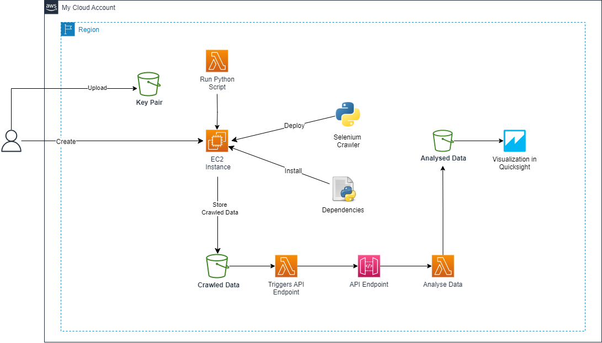

# Web Scrapping using AWS Services

This project is an automated web scrapping using AWS services. The project is divided into two parts: the first part is the web scrapping and the second part is the data analysis. 

### Challenge:
To create a pipeline that
* ⚠️ Crawl a website
* ⚠️ Store the data
* ⚠️ Analyze the data with API
* ⚠️ Automate the system

### Web Scrapping Tool
- Selenium

### AWS Services used

* ✅ Amazon EC2
* ✅ Amazon S3
* ✅ AWS Lambda
* ✅ Amazon API Gateway
* ✅ AWS Step Functions
* ✅ Amazon QuickSight
* ✅ AWS Cloudwatch Events


## Architecture

The architecture for the pipeline is

<p align="center">
    
</p>


For Automation, I have used AWS Step Functions.

<p align="center">
    
</p>

Then, I have used AWS Cloudwatch Events to create a rule to trigger/schedule the Step Functions to run at specific time.

### Implementation

1. **Deploy the Selenium crawler and install necessary dependencies on EC2 instance.** 
   <br>

    In this project, `selenium_crawler.py` is used to crawl the website which is given in the repo.
    <br>

    The crawler data can be represented as below:

    <p align="center">
        
    </p>

    <br>
    Initially the code is tested in local system. After successful testing, the code is deployed in EC2 instance.
    
    <br>

    Before setting up the environment on Amazon EC2, initially make sure you ahve IAM roles access to you. You should have S3FullAccess(or at least S3 GetObject & PutObject) policy, and EC2FullAccess policy attached to you.
    
    <br>

    On your AWS Management console, Now:

    - Configure a ubuntu instance and have it running on your EC2
    (For this project, t2.micro instance type is minimum requirement)

    - While creating EC2 instance, you will be asked to create a key pair. Create a key pair and download it. This key pair will be used to connect to your EC2 instance.


    <br>
    Now, connect to your EC2 instance using SSH client. Before that, make sure you have the key pair with the necessary permissions for it.

    - Open your terminal and type the following command to connect to your EC2 instance.

    `ssh -i <keypair.pem> ubuntu@<public_ip_address>`


    <br>

    After that, you will be connected to your EC2 instance and seeing following output.

    <p align="center">
        
    </p>

    <br>

    In this terminal, install awscli using following command.
    
    `sudo apt install awscli` 

    <br>

    After that, you should configure your AWS credentials into the EC2 Instance. It contains user name, password, access key, secret access key, region name and output format. Hit following command and enter the details.

    `aws configure`

    <br>

    Now install google chrome and chrome driver in your EC2 instance. It is necessary for selenium crawler to run. For that, hit following commands.

    `wget https://dl.google.com/linux/direct/google-chrome-stable_current_amd64.deb`

    <br>

    Run following command to install Chrome using the offline installer:

    `sudo apt install ./google-chrome-stable_current_amd64.deb`
    
    `sudo apt -f install`

    <br>

    Check your google chrome version using:
    
    `google-chrome --version`

    <br>

    After that install chrome driver in this machine. For that hit following commands.

    `wget https://chromedriver.storage.googleapis.com/103.0.5060.53/chromedriver_linux64.zip`

    <br>

    Note*: Check your chrome version and download the chrome driver accordingly. In this case, chrome version is 103.0.5060.53.

    `sudo apt install unzip`
    
    `unzip chromedriver_linux64.zip`
    
    `sudo mv chromedriver /usr/bin/chromedriver`
    
    `sudo chown root:root /usr/bin/chromedriver`

    <br>

    After that create bucket in the Amazon S3 and copy that bucket name.

    <br>

    Now, in the same terminal, lets install all the dependencies for the crawler.

    <br>

    First of all, install pip3 using following command.
    
    `sudo apt-get -y install python3-pip`

    <br>

    Now after installing pip, make sure you hit
    
    `source ~/.profile`

    <br>

    Now, install pandas, selenium and boto3. I used selenium version 3.141.0.

    `pip3 install pandas`  
    
    `pip3 install selenium==3.141.0`
    
    `pip3 install boto3`

    <br>

    After that, create a directory named selenium-code.

    `mkdir selenium-code`
    
    `cd selenium-code`

    <br>

    Now, create a file named `selenium_crawler.py` and copy the code from the repo.

    <br>

    Note: In the code, change the bucket name to your bucket name at the final line of **crawler** code.

    <br>

    Save the vim editor by typing ‘:wq’. Finally, run your python script:

    `python3 selenium_crawler.py`

    <br>

    After some time, you will be seeing csv file in your S3 bucket.
    <br>

2. **Create API Endpoint using AWS API Gateway**

   - Initially, create a lambda function named `Selenium_api.py` and copy the code from the repo. In the lambda function, change the bucket name according to yours. Select a runtime compatible with your code. In this case, I have used Python 3.10. After that deploy your code. Then click on **Test**. The result you should obtain must be similar to the following:
     <hr>
     
     <p align="center">
       
   </p>

   - Now, create an API Gateway. In the AWS Management Console, create a new API Gateway. Choose the "REST API" type and provide a name for your API. Inside the API Gateway configuration, define a resource that represents the endpoint for accessing the CSV data. For example, you can create a resource named "csv-data". Within the resource, add a method (i.e. GET) to define how the API will handle requests to that resource. Choose the "Integration type" as "Lambda function" and select the Lambda function you created earlier. Use the "Integration Request Type" as "LAMBDA_PROXY".
     <br>

   - After that, deploy the API. In the "Actions" dropdown menu, select "Deploy API". Choose "New Stage" and provide a name for the stage. After that, you will be provided with an "Invoke URL" that you can use to access the API. Copy the URL and paste it in your browser. You should see the CSV data in your browser.

<br>

   Entire operation works like following diagram.

   <p align="center">
       
   </p>

   Note: Remember to add necessary policy to the role that aws lambda automatically creates for you. In this case, add policy that provide read access to the S3.

3. **Analyse data using API**

   - Create new lambda function similar to above. In this case, I have named it as `Selenium_analysis.py`. Copy the code from the repo. In the code, change the API url according to yours. After that deploy your code. Then click on **Test**. The result you should obtain must be similar to the following:
     <hr>
     
     <p align="center">
       
   </p>

   Note: Here the lambda function will save the analyse data to S3 bucket. So, make sure you have created new bucket for this purpose. Then, change the bucket name accordingly in the code.
   <br>

4. **Run EC2 Instance code using Lambda**
   
   In this project, i have tried to automate the proces. So crawling should be done automatically as well. To make it possible i.e. run selenium crawler in EC2 instamce, I have used AWS Lambda. So, create a new lambda function named `Selenium_ec2.py` and copy the code from the repo. Make the configuration same as above. After that deploy your code. Then click on **Test**. The result you should obtain must be similar to the one when we run the program using SSH to EC2 instance i.e. crawled data will be stored in S3. 

   <br>

   Note: Here the lambda function will be using a package named `paramiko` that is not pre-installed in lambda. So you have to configure it by yourself. 

    <br>

    We do this by adding layers in Lambda function and uploading zip file to it which consist of necessary package. However, in this project, to correctly execute use following procedure.

    <br>

    - In the `AWS Cloud9 console`, create an Amazon Elastic Compute Cloud (Amazon EC2) instance with Amazon Linux 2 AMI.
    -  `Create an AWS Identity and Access Management (IAM) policy` that grants permissions to call the PublishLayerVersion API operation.
    <br>

    **Example IAM policy statement that grants permissions to call the PublishLayerVersion API operation**

    ``` 
       {
        "Version": "2012-10-17", 
        "Statement": [
            {
            "Sid": "VisualEditor0",
            "Effect": "Allow",
            "Action": "lambda:PublishLayerVersion",
            "Resource": "*"
            }
        ]
        }
    ```

    <br>

    -  `Create an IAM role` and attach the IAM policy to the role. Then, attach the IAM role to the Amazon EC2 instance.

        <br>

        Note: Your EC2 instance now has permissions to upload Lambda layers for the PublishLayerVersion API call.
        <br>

    - Open your AWS Cloud9 Amazon EC2 environment. Then, install Python 3.8 and pip3 by running the following commands:

        `$ sudo amazon-linux-extras install python3.8`
        
        `$ curl -O https://bootstrap.pypa.io/get-pip.py`
        
        `$ python3.8 get-pip.py --user`

    <br>

    - Create a python folder by running the following command:

        `$ mkdir python`

    <br>

    - Install the `paramiko` library files into the python folder by running the following command:

        `$ python3.8 -m pip install paramiko -t python/`

    <br>

    -  Zip the contents of the python folder into a layer.zip file by running the following command:

        `$ zip -r layer.zip python`

    <br>

    - Publish the Lambda layer by running the following command:

        <br>

        Important: Replace `us-east-1` with the AWS Region that your Lambda function is in.

        `$ aws lambda publish-layer-version --layer-name paramiko-layer --zip-file fileb://layer.zip --compatible-runtimes python3.8 --region us-east-1`

    <br>

    - Finally, Add the layer to your Lambda function.

    <br>


5. **Automate the system using AWS Step Functions**

   <br>

   Till now we have created three lambda functions: `Selenium_ec2.py` to run command in EC2 Instance, `Selenium_api.py` to trigger an API endpoint, and `Selenium_analysis.py` to analyse the crawled data. So we will be using these lambda functions to automate the system using AWS Step Functions.

   <br>

    Go to the `AWS Step Functions console` and create a new `state machine`. In the "Authoring" section, Choose Type of `Standard` and click `Next`.
    
    <br>

    Then, Define the state machine as follows:

    - Drag `AWS Lambda Invoke` from left side to create a state.
    - Click on the state and provide a name for the state and select the lambda function you want to invoke. In this case, I have selected `Selenium_ec2.py`.
    - Similarly create another state and repeat same process. 
  
    <br>

    Like this you can create simple Step Function.

    After that you can `Start Execution` and see the result. You may see the `timeout error` as well. The state which give those error, increase time for them respectively.

    After successful, execution of step function, move to the next step.

    <br>

6. **Schedule the Step Function**

    Finally you can schedule this step function to run at specific time. For that, you can use `AWS Cloudwatch Events`. Go to Cloudwatch Console and in the left hand side, click events. From there, you can create a new rule. In the rule, you can select the target as `Step Function` and select the step function you want to run. After that, you can select the time you want to run the step function. 
